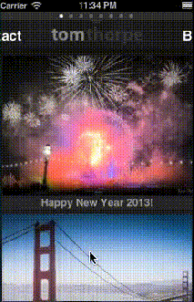
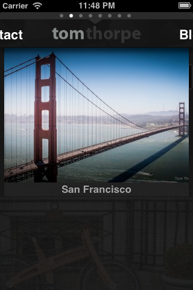
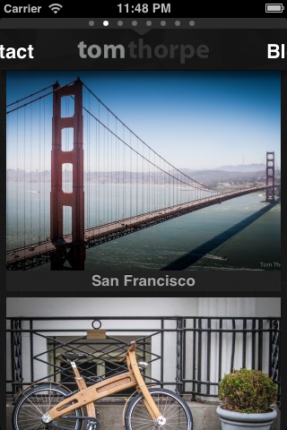

UITableViewZoomController
=========================

A Cocoa Touch UITableViewController subclass that provides a zoom effect as cells appear for the first time (similar in style to Google+ iPhone app)



*Example of UITableViewZoomController in action (using a custom cell with the SDWebImage Library). This is just an idea of what it can look like, the implementation of the cell design is up to you! This library just takes care of the aniamation into view.*

[Youtube Video](http://www.youtube.com/watch?v=88l25kBV9so&feature=youtu.be "Youtube Video")





Usage
---
* In the Source directory, find `TTUITableViewZoomController.h` and `TTUITableViewZoomController.m` and include them in your project.
* Where you would normally use (subclass) a `UITableViewController`, #import "TTUITableViewZoomController.h" and subclass `TTUITableViewZoomController` instead.
* That's it!

Options
---
There are a few options that you can use to customise the animation. These are set by Properties. You should set them in the viewDidLoad method in the Controller where you have subclassed UITableViewZoomController 

* `cellZoomXScaleFactor` - How much to scale to x axis of the cell before it is animated back to normal size. 1 is normal size. >1 is bigger, <1 is smaller. Default if not set is 1.25
* `cellZoomYScaleFactor` - How much to scale to y axis of the cell before it is animated back to normal size. 1 is normal size. >1 is bigger, <1 is smaller. Default if not set is 1.25
* `cellZoomInitialAlpha` - The initial alpha value of the cell when it starts animation. For example if you set this to be 0 then the cell will begin completely transparent, and will fade into view as well as zooming. Value between 0 and 1. Default if not set is 0.3
* `cellZoomAnimationDuration` - The duration of the animation effect, in seconds. Default if not set is 0.65 seconds
* `cellZoomXOffset` - Allows you to specify an X offset (in pixels) for the animation's initial position, so for example if you say -50 this will mean as well as the rest of the animation, the cell also comes in from 50 pixels to the left of the screen. If you say 100 it will come in from 100 pixels to the right of the screen. Combine it with the cellZoomYOffset to get the cell to come in diagonally (see TabThreeViewController in Demo examples). If not set, the default is 0.
* `cellZoomYOffset` - Allows you to specify a Y offset (in pixels) for the animation's initial position, so for example if you say -50 this will mean as well as the rest of the animation, the cell also comes in from 50 pixels to the top of the screen. If you say 100 it will come in from 100 pixels to the bottom of the screen. Combine it with the cellZoomXOffset to get the cell to come in diagonally (see TabThreeViewController in Demo examples). If not set, the default is 0.

Example Code
---
MyTableViewController.h:
```  objc
#import <UIKit/UIKit.h>
#import "TTUITableViewZoomController.h"

@interface MyTableViewController : TTUITableViewZoomController

@end
```
MyTableViewController.m:
```  objc
#import "MyTableViewController.h"

@implementation MyTableViewController
-(void)viewDidLoad{
    self.cellZoomInitialAlpha = [NSNumber numberWithFloat:0.1]; //these six properties are optional. If you don't supply them defaults will be used.
    self.cellZoomAnimationDuration = [NSNumber numberWithFloat:0.3];
    self.cellZoomXScaleFactor = [NSNumber numberWithFloat:1.3];
    self.cellZoomYScaleFactor = [NSNumber numberWithFloat:1.3];
    self.cellZoomXOffset = [NSNumber numberWithFloat:-75];
    self.cellZoomYOffset = [NSNumber numberWithFloat:75];
}

/*Do the rest of the Table View Datasource and Delegate methods here as usual*/

@end
```

Then just create an instance of MyTableViewController and add it to any view or window as you normally would!

Demo
---
The included source is an XCode project which you can open to see a demo.

The Demo/TableViews folder also shows three examples of UITableViewControllers that subclass TTUITableViewZoomController:
* `TabOneViewController` - Uses all the default options for UITableViewZoomController with a custom cell style showing an image. (In my opinion, this effect generally works best on custom cell styles than the Apple UITableViewCell default cell styles)
* `TabTwoViewController` - Uses one of the default Cocoa Touch styles for UICellView (UITableViewCellStyleSubtitle). Then overrides the default UITableViewZoomController properties for the InitialAlpha, XScaleFactor, YScaleFactor and AnimationDuration to result in a slightly quicker animation, that zooms in rather than out, and doesn't fade at all. 
* `TabThreeViewController` - Similar to TabOneViewController, but overrides the cellZoomXOffset and cellZoomYOffset properties to make the animation come in diagonally from the bottom left, and the AnimationDuration property to speed up the animation (like the latest version of the Google+ app)  

You can also refer to these demos for reference of how to use the library if anything is unclear :-)
